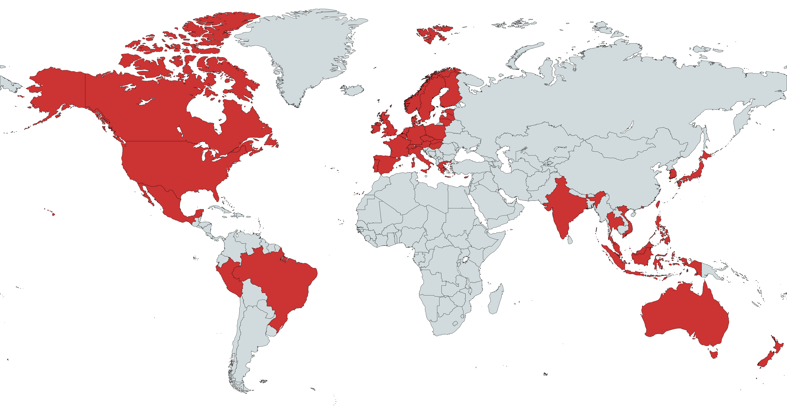

# Simple Address Format

Easy to use, language agnostic templates for combining address parts into a full address with a country specific format.

For example, the UK address parts

```yaml
house_name: Challenger Court
street_number: 49
street_name: Wallis Avenue
unit: Flat 4
city: Maidstone
postalcode: ME15 9HS
state: England
country: United Kingdom
```

become the multiline and singleline addresses

```
Flat 4
Challenger Court
49 Wallis Avenue
Maidstone
ME15 9HS
United Kingdom

Flat 4, Challenger Court, 49 Wallis Avenue, Maidstone, ME15 9HS, United Kingdom
```

## Coverage



We currently support the following countries and territories

## Why is this necessary?

Address formats vary from country to country. In Peru street numbers are written after the street name whereas, in the US and UK, they're written before the street name. In the US a unit (flat, apartment, floor, etc.) is written after
the street name and number but in the UK, it is often at the very start of the address. This requires us to have local knowledge of each country's standard address format if we want to correctly display addresses to users.

## Inspiration

This project is heavily inspired and really, just an extension of [OpenCage's address-formatting](https://github.com/OpenCageData/address-formatting) project. So why a new project?

Well, at [Naurt](https://www.naurt.com) we're building a geocoder focused on delivery and we therefore wanted to include two additional items that are important for our use case:

- A unit field (flats, apartments, units, floors, etc.)
- Multiline and singleline address formats. Multiline for physical mail as seen on letters. Single line for digital representation such as the output from our [geocoder](https://docs.naurt.com).

We also wanted to simplify the address fields available to format. OpenCage's project is geared towards open source address data such as that from [OpenStreetMaps](https://www.openstreetmap.org/) which is often more detailed than closed source address data. We've therefore
reduced the number of fields available to a minimum to get a person or parcel to the correct place, keeping things as simple as possible. Below are the set fields we use.

### Address parts

```yaml
unit: String
house_name: String
street_number: String
street_name: String
locality: String
city: String
county: String
state: String
country: String
postalcode: String
```

This is obviously not a complete list of address parts found throughout the world. Often countries will have provinces, districts, boroughs, blocks, and various other names to describe regions of a country.
Though, we believe that they can be accurately mapped to one of these basic fields. For instance, a neighborhood or borough becomes a locality and a province becomes a state. Picking a standard allows
us to unify the way we parse, search for, store, and display our addresses across our geocoding services.

### Implementations

Following on from the OpenCage model, this repository contains only templates written in [mustache](https://mustache.github.io/) with some test cases. The templates are stored in [YAML](https://www.anbowell.com/blog/the-developers-guide-to-yaml/) with countries denoted by their [two letter ISO](https://en.wikipedia.org/wiki/ISO_3166-1_alpha-2) code.
This enables the templates to be implemented in any programming language required, by anybody. We provide a Rust library, [simple-address-formatter](https://github.com/Naurt-Ltd-Public/simple-delivery-address-rs), as an example implementation.

- **Rust**: [simple-address-formatter](https://github.com/Naurt-Ltd-Public/simple-delivery-address-rs)

## Roadmap & Contributing

We hope for this project to grow with Naurt. As Naurt's geocoder moves into new territories, we'll be adding new formats as and when we need them. Though, we'd love for community contributions to help us on our way with local knowledge!
To contribute, simply open up a pull request and follow along with a few simple rules:

- Include a multiline and singleline address. A multiline address should be split with `\n` and a singleline address should be split with `,`.
- Use a two letter ISO code for the country or territory added.
- Add at least one test case consisting of `description`, `components`, `expected_multiline`, and `expected_singleline` fields.
